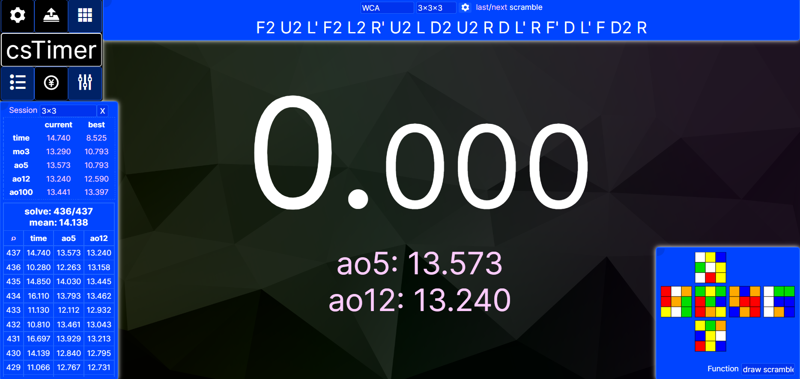

# Inter font for [csTimer](https://cstimer.net)

An extension that changes text fonts in csTimer to Inter, as well as making some barely-noticable style changes.

Locations for where I changed fonts to Inter came partly from John Backus' [cstimer-makeover](https://github.com/backus/cstimer-makeover). 

# Before

# After

# Here's what my csTimer looks like after using this extension!

