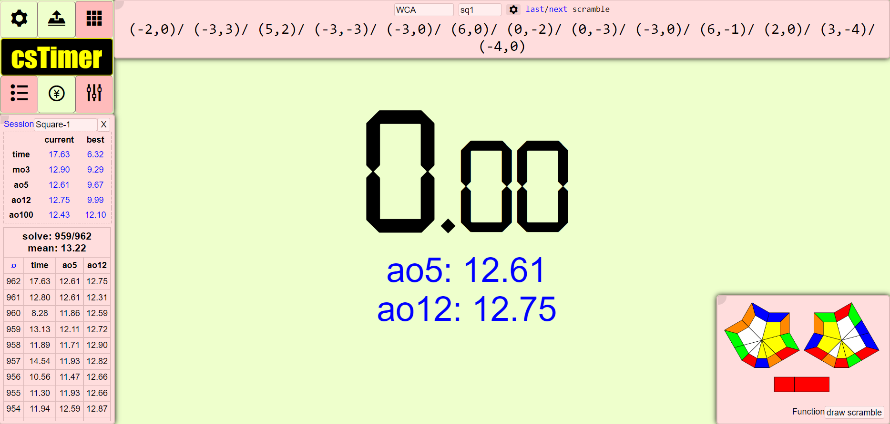

# Inter font for [csTimer](https://cstimer.net)

### An extension that changes text fonts in csTimer to Inter, as well as making some barely-noticable style changes.

Locations for where I changed fonts to Inter came partly from John Backus' [cstimer-makeover](https://github.com/backus/cstimer-makeover).

# NOTE

Some long times may be too large to fit on the screen, especially if you use something like [csTimer+](https://chromewebstore.google.com/detail/cstimer+/bfafldbloncllehfiaflmmjhohiobfmo?hl=en). Sorry big cube lovers!

# How to Use

This extension is not on any web stores, so if you would like to use this extension and don't know how, check out this quick [tutorial](https://github.com/Wo0fle/inter-for-csTimer/wiki) I made.

# Before

# After

